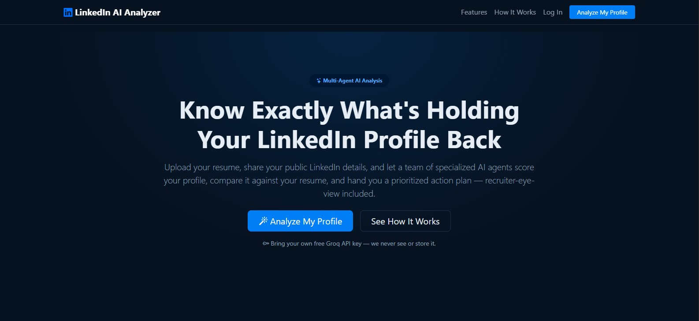
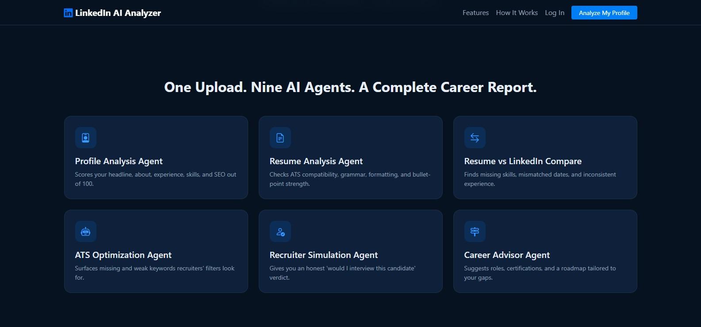
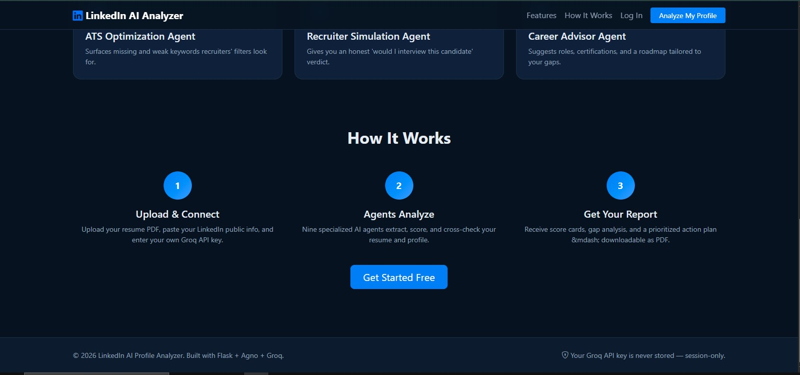
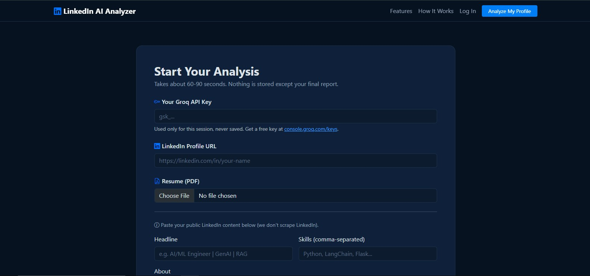
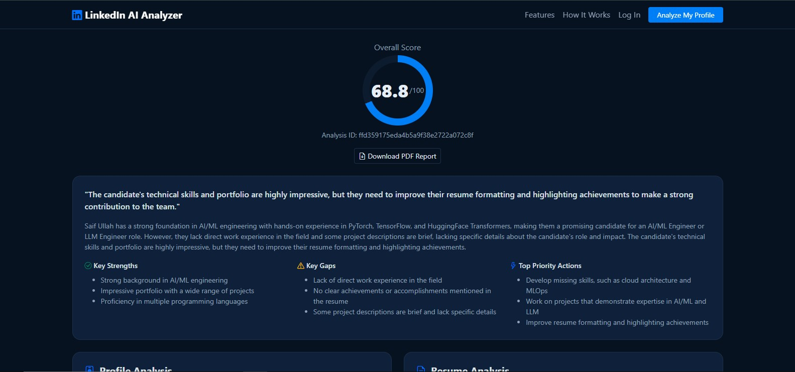
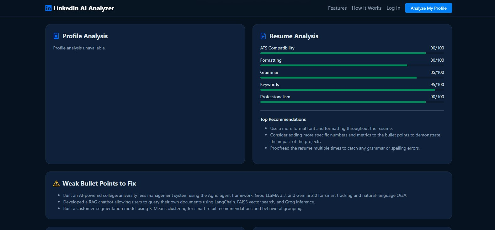
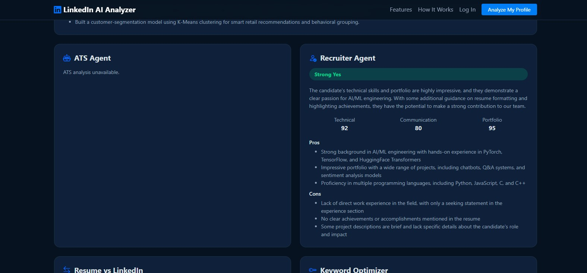
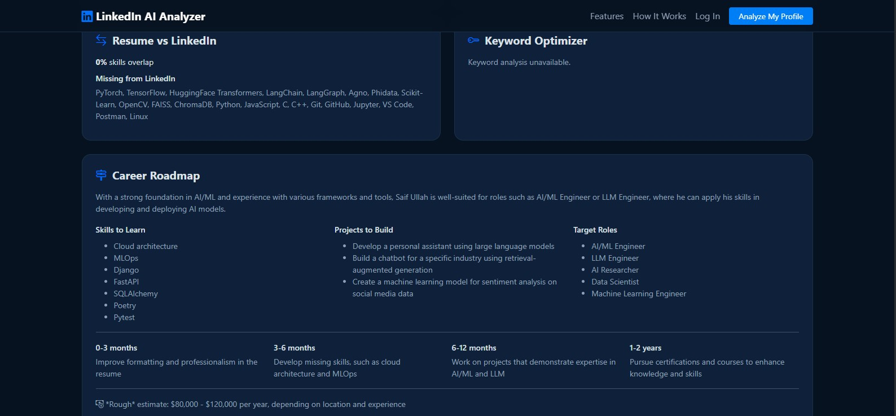

<div align="center">


<a href="https://github.com/saifullah857/linkedin-ai-analyzer">
  
</a>

<br/>

[](https://python.org)
[](https://flask.palletsprojects.com)
[](https://github.com/agno-agi/agno)
[](https://groq.com)
[](LICENSE)

[](https://github.com/saifullah857/linkedin-ai-analyzer/stargazers)
[](https://github.com/saifullah857/linkedin-ai-analyzer/network/members)
[](https://github.com/saifullah857/linkedin-ai-analyzer/commits/main)
[](https://github.com/saifullah857)


</div>

<br/>

## ✨ What is this?

**LinkedIn AI Profile Analyzer** takes your resume + LinkedIn details and runs them through **9 specialized AI agents** — coordinated by one master agent — to hand you a recruiter's-eye-view report: scores, gaps, keyword fixes, and a prioritized career roadmap. Bring your own free Groq API key; nothing is ever stored.

<div align="center">

</div>

<br/>

## 📋 Table of Contents

<details open>
<summary>Click to expand</summary>

- [Live Screenshots](#-live-screenshots)
- [The 9 Agents](#-the-9-agents)
- [Sample Report Output](#-sample-report-output)
- [Architecture](#-architecture)
- [Tech Stack](#-tech-stack)
- [Quick Start](#-quick-start-uv)
- [Environment Variables](#-environment-variables)
- [Running Tests](#-running-tests)
- [Deployment](#-deployment)
- [Security Design](#-security-design)
- [Roadmap](#-roadmap)
- [Contributing](#-contributing)
- [License](#-license)
- [Contact](#-contact)

</details>

<br/>

## 📸 Live Screenshots

<div align="center">

### Landing Page


<br/><br/>

### Nine AI Agents, One Career Report


<br/><br/>

### How It Works


<br/><br/>

<table>
<tr>
<td width="50%">

**Start Your Analysis**


</td>
<td width="50%">

**Results Dashboard**


</td>
</tr>
<tr>
<td width="50%">

**Resume Analysis**


</td>
<td width="50%">

**Recruiter Agent Verdict**


</td>
</tr>
</table>

<br/>

### Career Roadmap


</div>

<br/>

## 🤖 The 9 Agents

<div align="center">

| # | Agent | What it does |
|:-:|-------|---------------|
| 1️⃣ | **Resume Analysis Agent** | Extracts structured data, scores ATS/formatting/grammar/keywords/professionalism |
| 2️⃣ | **Profile Analysis Agent** | Scores headline, about, experience, skills, SEO, recruiter-friendliness |
| 3️⃣ | **Comparison Agent** | Finds gaps between resume and LinkedIn — missing skills, mismatched dates |
| 4️⃣ | **ATS Agent** | Checks ATS parseability, surfaces missing/weak keywords |
| 5️⃣ | **Career Advisor Agent** | Suggests roles, certifications, courses, and a phased roadmap |
| 6️⃣ | **Keyword Optimizer Agent** | Surfaces high-value AI/ML/backend/cloud/RAG/LLM/GenAI keywords |
| 7️⃣ | **Recruiter Agent** | Honest "would I interview this candidate" verdict, pros/cons |
| 8️⃣ | **Content Analyzer Agent** | Scores public LinkedIn posts and rewrites weak ones |
| 9️⃣ | **Report Generator Agent** | Synthesizes everything into one executive summary |

</div>

> A deterministic **Master Coordinator** runs all nine agents, isolates any single agent's failure so one bad LLM response can't crash the whole analysis, and computes the overall score independently of the LLM.

<br/>

## 📊 Sample Report Output

> Real output from an actual run against this project's own resume — score, verdict, and all.

<div align="center">

### Overall Score: **68.8 / 100**

*"The candidate's technical skills and portfolio are highly impressive, but they need to improve their resume formatting and highlighting achievements to make a strong contribution to the team."*

</div>

<table>
<tr><th>Resume Scores</th><th>Recruiter Verdict</th></tr>
<tr>
<td>

| Category | Score |
|----------|:-----:|
| ATS Compatibility | 90/100 |
| Formatting | 80/100 |
| Grammar | 85/100 |
| Keywords | 95/100 |
| Professionalism | 90/100 |

</td>
<td>

**🟢 Strong Yes**

| Category | Rating |
|----------|:-----:|
| Technical | 92/100 |
| Communication | 80/100 |
| Portfolio | 95/100 |

</td>
</tr>
</table>

**Top Priority Actions:** Develop missing skills like cloud architecture & MLOps · Ship more AI/ML + LLM projects · Improve resume formatting and quantify achievements

**Suggested Roadmap:** `0-3mo` Polish resume → `3-6mo` Learn cloud + MLOps → `6-12mo` Ship expert-level AI/LLM projects → `1-2yr` Pursue certifications

📄 Full report downloadable as PDF from any results page — [see a real example](docs/sample-report.pdf).

<br/>

## 🏗️ Architecture

```
linkedin-ai-analyzer/
├── app.py                  # Flask application factory + routes
├── config.py                # Environment-driven config (dev/prod)
├── agents/                  # One file per specialist agent + coordinator
│   ├── master_agent.py      # Orchestrates all 9 agents, fault-isolated
│   ├── resume_agent.py · profile_agent.py · comparison_agent.py
│   ├── ats_agent.py · career_agent.py · keyword_agent.py
│   ├── recruiter_agent.py · content_agent.py · report_agent.py
├── tools/                    # Deterministic custom Agno tools
├── services/
│   ├── groq_client.py        # Builds Groq model from session-only API key
│   └── pdf_report.py         # reportlab PDF export
├── models/                   # SQLAlchemy ORM (AnalysisReport, User)
├── templates/                 # Jinja2 + Bootstrap 5, dark navy/blue theme
├── static/{css,js}/
├── tests/                     # 37-test pytest suite
└── docs/screenshots/           # README assets
```

<br/>

## 🧰 Tech Stack

<div align="center">


</div>

<br/>

## 🚀 Quick Start (uv)

```bash
# 1. Install uv
curl -LsSf https://astral.sh/uv/install.sh | sh   # macOS/Linux
# irm https://astral.sh/uv/install.ps1 | iex        # Windows PowerShell

# 2. Clone & enter the project
git clone https://github.com/saifullah857/linkedin-ai-analyzer.git
cd linkedin-ai-analyzer

# 3. Create the venv and install deps
uv venv
.venv\Scripts\activate      # Windows
# source .venv/bin/activate  # macOS/Linux
uv pip install -r requirements.txt

# 4. Configure environment
cp .env.example .env
# set SECRET_KEY to a random string

# 5. Run
python app.py
```

Visit **http://localhost:5000**, drop in a free [Groq API key](https://console.groq.com/keys), your resume PDF, and go.

<br/>

## 🔑 Environment Variables

| Variable | Required | Default | Notes |
|----------|:--------:|---------|-------|
| `SECRET_KEY` | ✅ | — | Flask session signing key |
| `FLASK_ENV` | ❌ | `development` | `development` \| `production` |
| `DATABASE_URL` | ❌ | absolute `instance/database/app.db` | Only override for Postgres/MySQL |
| `GROQ_MODEL` | ❌ | `llama-3.3-70b-versatile` | Any Groq-hosted model ID |
| `RATE_LIMIT_DEFAULT` | ❌ | `100 per hour` | Global Flask-Limiter default |

> **The Groq API key is never an env var.** Every user supplies their own through the UI — it lives only in the server-side session for that browser session.

<br/>

## 🧪 Running Tests

```bash
uv pip install pytest==8.3.3
uv run pytest tests/ -v
```

<div align="center">


</div>

Covers routes, auth flow, deterministic scoring tools, and full 9-agent pipeline orchestration — including fault-isolation (one agent failing doesn't crash the run) and a regression test for a real relative-sqlite-path bug that once broke fresh installs.

<br/>

## 🌐 Deployment

<table>
<tr><th>Gunicorn</th><td>

```bash
gunicorn -w 4 -b 0.0.0.0:8000 "app:app"
```

</td></tr>
<tr><th>Docker</th><td>

```bash
docker build -t linkedin-ai-analyzer .
docker run -p 8000:8000 -e SECRET_KEY=your-secret linkedin-ai-analyzer
```

</td></tr>
<tr><th>Render / Railway</th><td>
Build: <code>pip install -r requirements.txt</code> · Start: <code>gunicorn -w 4 -b 0.0.0.0:$PORT app:app</code>
</td></tr>
</table>

<br/>

## 🔒 Security Design

- 🔑 **Groq API key never stored** — session-only, never written to disk or DB
- 🗑️ **Resume PDFs deleted immediately** after text extraction
- 👤 **Login is optional** — full analysis works for anonymous visitors
- 🚦 **Rate limiting** on `/analyze`, `/login`, `/register`, and PDF export
- 🧩 **Per-agent fault isolation** — one failing agent never crashes the report

<br/>

## 🗺️ Roadmap

- [ ] Async job queue (Celery + Redis) so `/analyze` doesn't block on 9 sequential LLM calls
- [ ] ChromaDB-backed semantic search across a user's past reports
- [ ] Multi-language resume support
- [ ] Animated score count-up on the results dashboard

<br/>

## 🤝 Contributing

Contributions, issues, and feature requests are welcome!

```bash
git checkout -b feature/your-feature
git commit -m "Add: your feature"
git push origin feature/your-feature
```

Then open a Pull Request. ⭐ Star the repo if this project helped you!

<br/>

## 📄 License

Distributed under the **MIT License**. See [`LICENSE`](LICENSE) for details.

<br/>

## 📬 Contact

<div align="center">

**Saif Ullah Khalid**
AI/ML Engineer · Full-Stack Developer · Instructor @ Abbas College of Technology

[](https://github.com/saifullah857)
[](https://linkedin.com/in/saif-ullah-khalid-412221379)

<br/>


</div>
